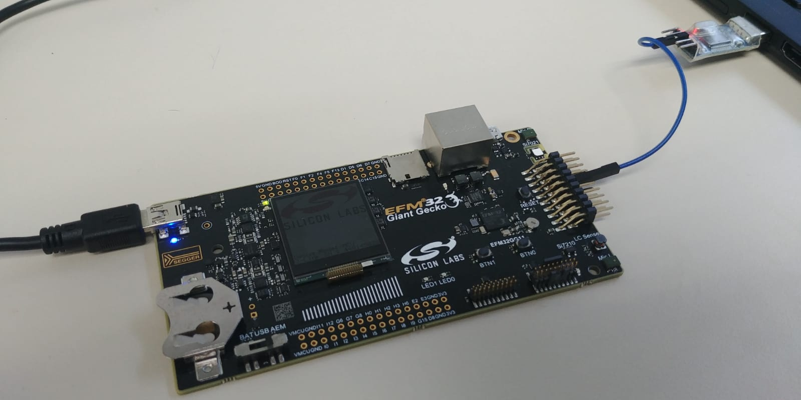

Author: Matthias J. Kannwischer <matthias@kannwischer.eu>

This tutorial explains how you can get started with the [EFM32GG11 Giant Gecko Starter Kit](https://www.silabs.com/development-tools/mcu/32-bit/efm32gg11-starter-kit) which has a [EFM32GG11B820F2048GL192](https://www.silabs.com/mcu/32-bit/efm32-giant-gecko-gg11/device.efm32gg11b820f2048gl192) Cortex-M4 core.

It has 
- 515 KiB RAM
- 2 MiB Flash
- runs at at most 72 MHz

To receive serial output you will also need a USB-TTL converter together with a 2-pin dupont / jumper cable.

# Contents

1. [Introduction](#introduction)
2. [Setup](#setup)
3. [Building](#building)
4. [Connecting the board](#connecting-the-board)
5. [Flashing](#flashing)
6. [Receiving Serial Output](#receiving-serial-output)

# Introduction
Silicon Labs basically only supports to work with their [Simplicity Studio](https://www.silabs.com/products/development-tools/software/simplicity-studio)
which I had serious issues to get to work under Linux (Arch Linux and Ubuntu).
Eventually I gave up on it and installed it on Windows.
As this is not a workable solution for me, I ripped out all the stuff I need
and created this Makefile-based repository which is based on [efm32-base](https://github.com/ryankurte/efm32-base).
This should be sufficient to start implementing crypto on embedded devices,
e.g., to get code from [pqm4](https://github.com/mupq/pqm4) running.

The goal of this repo is to provide a simple Makefile that can be easily extended to whatever you need on the EFM32GG11. In case you want to work with another board, I suggest that you look at [efm32-base](https://github.com/ryankurte/efm32-base).


This example shows how
- the Giant Gecko can talk your laptop using serial communication.
- you can obtain cycle counts using SysTick (alternatively, you can also use the CYCCNT if you need to count less than 2^32 cycles).
- you can get randombytes from the hardware random number generator.
- you can downclock the core to 16 MHz (maximum frequency is 72 MHz), so that there are no wait states when fetching instructions and data from flash. This allows to get cycle counts that are very close to the ones on other Cortex-M4 cores without wait states (e.g., the pqm4 target STM32F407 at 24 MHz).
- you can use the AES128, AES256, and SHA256 hardware acceleration.
- you can use the hardware accelerator for 128x128-bit and 256x256-bit multiplication.

# Setup
As usual you will need the [arm-none-eabi toolchain](https://launchpad.net/gcc-arm-embedded) toolchain installed.
For flashing binaries onto the board, you will need to install the [J-Link Software and Documentation Pack](https://www.segger.com/downloads/jlink/). After installing, make sure that `JLinkExe` is in your `PATH`.

For using [host_unidiretional.py](./host_unidirectional.py) you will need [Python](https://www.python.org/download) and [pyserial](https://pypi.org/project/pyserial/). Alternatively, you can use [screen](https://www.gnu.org/software/screen/).

If you are on Arch Linux, you can simply run the following and should be done:

```
yay -S arm-none-eabi-gcc jlink-software-and-documentation python-pyserial
```

On Ubuntu, you can install [pyserial](https://pypi.org/project/pyserial/) and [arm-none-eabi toolchain](https://launchpad.net/gcc-arm-embedded) using:

```
sudo apt install gcc-arm-none-eabi python3-serial
```
You will have to have to install the [J-Link .deb](https://www.segger.com/downloads/jlink/) manually.


# Building

After you recursively cloned this repo (`git clone  --recurse-submodules https://github.com/mkannwischer/EFM32-getting-started`), running `make` in the root directory should produce `efm32-test.bin`.

Have a look at [main.c](main.c).

# Connecting the board
Connect the board to your host machine using the mini-USB port (upper left corner of the board).
This provides it with power, and allows you to flash binaries onto the board.

It should show up in `lsusb` as `SEGGER J-Link OB`. 
If you are using a UART-USB connector that has a PL2303 chip on board (which appears to be the most common),
the driver should be loaded in your kernel by default. If it is not, it is typically called `pl2303`.
On macOS, you will still need to [install it](http://www.prolific.com.tw/US/ShowProduct.aspx?p_id=229&pcid=41) (and reboot).
When you plug in the device, it should show up as `Prolific Technology, Inc. PL2303 Serial Port` when you type `lsusb`.

Using dupont / jumper cables, connect the `RX`/`RXD` pin of the USB connector to the `PE8` pin (Pin 12 on the expansion header).
Depending on your setup, you may also want to connect the `GND` pin .

For the full pin-outs of the Giant Gecko's see Section 4 in the [User Guide](https://www.silabs.com/documents/public/user-guides/ug287-stk3701.pdf).

It should look like this:



# Flashing

The Giant Gecko comes with a [Segger J-Link debugger](https://www.segger.com/products/debug-probes/j-link/) that we use to flash binaries on the board.
You can simply run

```
./flash.sh efm32-test.bin
``` 
to program the binary onto the board.
For details see [flash.sh](flash.sh) and [flash.jlink](flash.jlink).

# Receiving Serial Output

You can either use [`screen`](https://www.gnu.org/software/screen/) or the provided Python script:

```
./host_unidirectional.py
```
